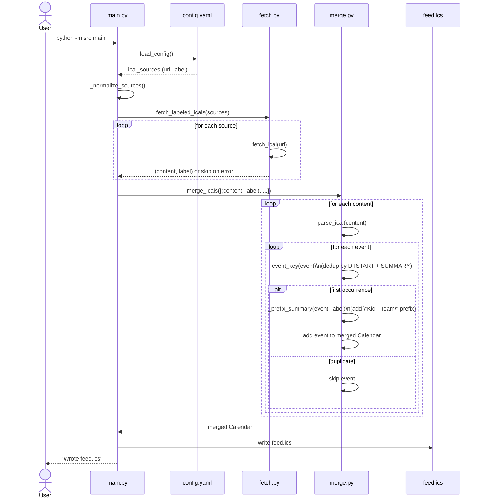
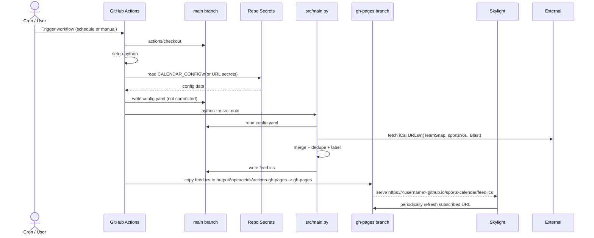

## Architecture Overview

This project aggregates multiple team/league calendars into a single iCal feed that can be subscribed to by Skylight (or any iCal-capable calendar).

### Components

- **Config (`config.yaml`)**
  - Defines `ical_sources`: list of `{ url, label }` objects.
  - Optional `gamesheets` section for future league API integration.
  - Local file, gitignored. A copy of its contents can be stored in the `CALENDAR_CONFIG` GitHub secret.

- **Fetcher (`src/fetch.py`)**
  - `fetch_ical(url)`: Fetches raw iCal text from an HTTP(S) URL with timeout and error handling.
  - `fetch_labeled_icals(sources)`: Takes a list of `{ url, label }` dicts, returns `[(content, label), …]`, skipping failed URLs.
  - `fetch_gamesheets(...)`: Stub for future Gamesheets API support.

- **Merger (`src/merge.py`)**
  - `parse_ical(content)`: Parses iCal text into VEVENT components.
  - `event_key(event)`: Computes a deduplication key from `DTSTART` + `SUMMARY`.
  - `_prefix_summary(event, label)`: Prefixes the event title with the source label.
  - `merge_icals(ical_contents)`: Merges events from multiple feeds, deduplicates by key, applies labels, and returns a single `Calendar`.

- **Orchestrator (`src/main.py`)**
  - `load_config()`: Loads YAML config from `config.yaml`.
  - `_normalize_sources(config)`: Normalizes config into a list of `{ url, label }` sources, supporting legacy `ical_urls`.
  - `main()`: Loads config, fetches all sources, merges them, writes `feed.ics` in the project root.

- **Automation (GitHub Actions)**
  - Workflow: `.github/workflows/build-feed.yml`
  - Triggers:
    - `schedule`: runs every 6 hours.
    - `workflow_dispatch`: manual runs from the Actions tab.
  - Steps:
    - Check out `main`.
    - Set up Python.
    - Build `config.yaml` from repository secrets.
    - Install dependencies.
    - Run `python -m src.main` to generate `feed.ics`.
    - Copy `feed.ics` into an `output/` directory.
    - Deploy `output/` to the `gh-pages` branch via `peaceiris/actions-gh-pages`.

- **Publishing (GitHub Pages + Skylight)**
  - GitHub Pages serves the `gh-pages` branch at:
    - `https://<username>.github.io/sports-calendar/`
  - The combined feed is available at:
    - `https://<username>.github.io/sports-calendar/feed.ics`
  - Skylight (or any calendar app) subscribes to the `feed.ics` URL once and receives updates on each workflow run.

### Config and Secrets

- **Local**
  - `config.yaml` (gitignored) contains real URLs and labels:

    ```yaml
    ical_sources:
      - url: "https://..."
        label: "Kid 1 - Hockey"
      - url: "https://..."
        label: "Kid 2 - Lacrosse"

    gamesheets:
      enabled: false
    ```

- **GitHub**
  - **Option A (recommended):** `CALENDAR_CONFIG` secret with the full contents of `config.yaml`.
  - **Option B:** Individual URL secrets (`TEAMSNAP_ICAL_URL`, `SPORTSYOU_ICAL_URL`, `BLAST_ICAL_URL`) for simple setups without labels.

The workflow writes a temporary `config.yaml` file on each run using these secrets; it is not committed to the repository.

## Sequence Diagrams

### Local Run



### GitHub Actions Run and Publish



`External` in the second diagram represents the remote calendar providers (TeamSnap, sportsYou, Blast). Gamesheets would be another external API in the future, converted to VEVENTs before merging.

